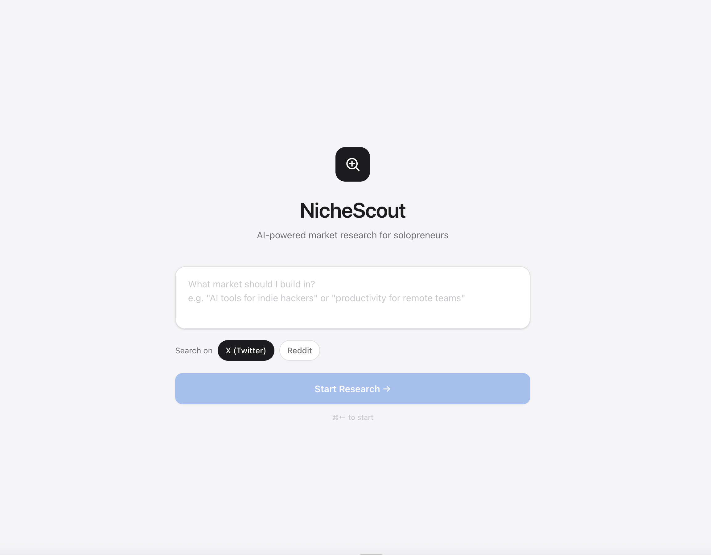
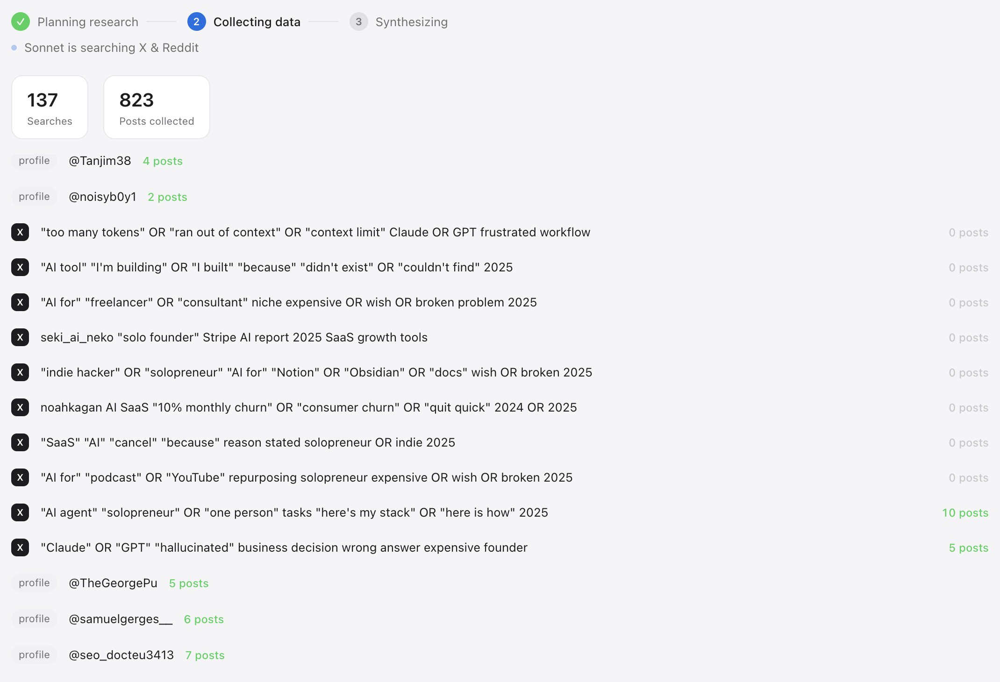
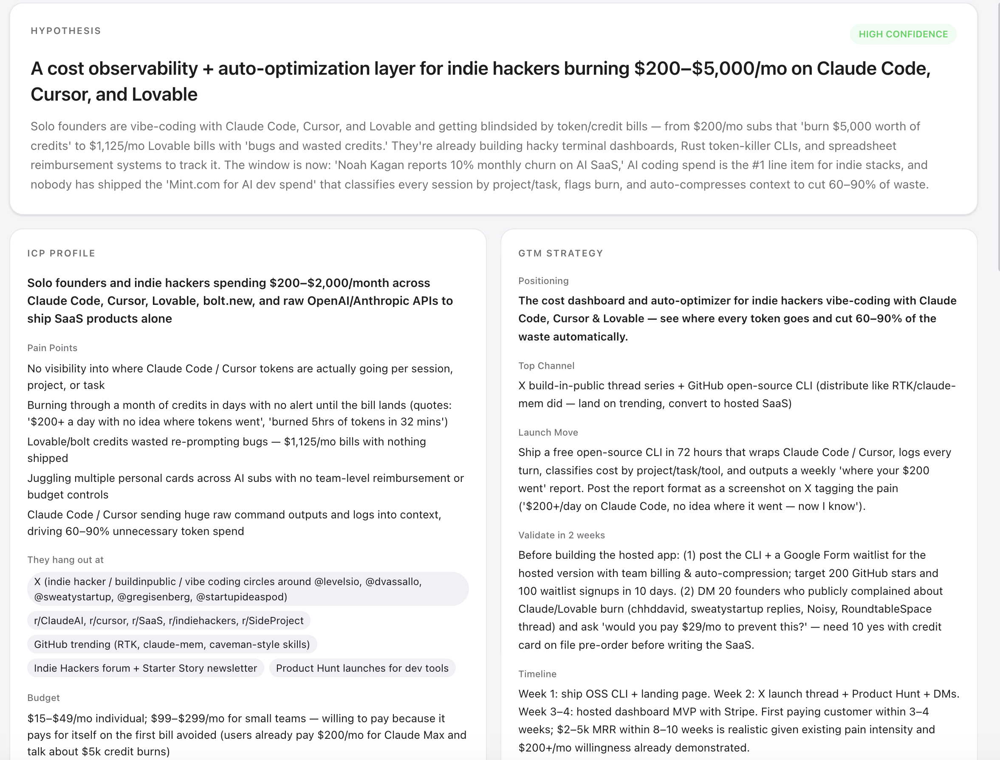
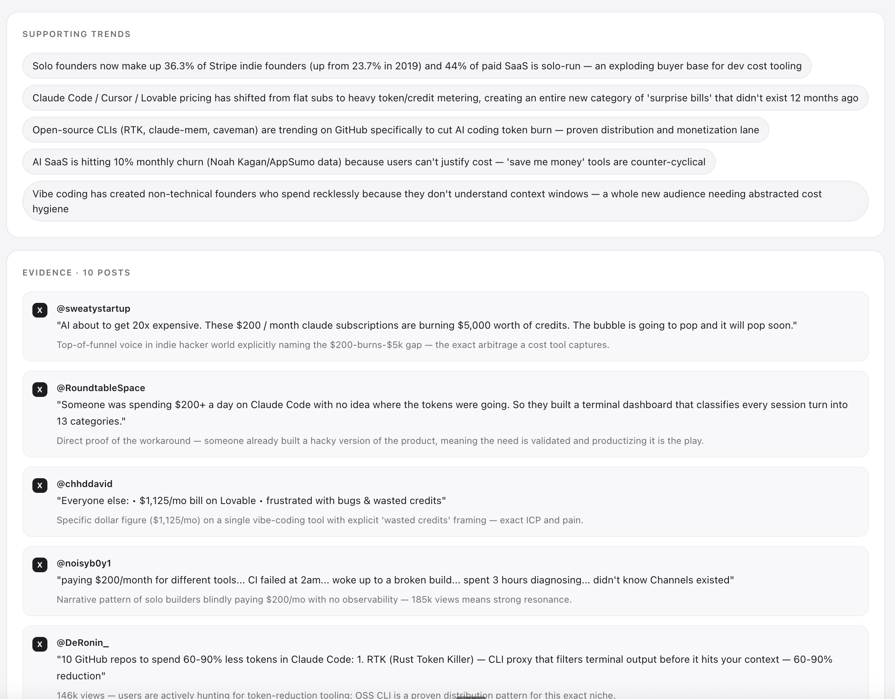

# NicheScout

**AI market research that reads X and Reddit so you don't have to.**

LLMs are trained on data from months ago. The niche you're about to enter may have already exploded — or died — since then. AI moves so fast that even a few weeks of lag means you're building on stale assumptions.

And the place where trends are born first is X. Except X actively blocks bots. So you can't just scrape it.

NicheScout cracks that. It drives a real Chrome browser logged in as you, reads live X threads and Reddit conversations, and hands the raw signal to Claude — which turns it into a hypothesis, a full ICP profile, and a go-to-market strategy. In minutes, not weeks.

Runs entirely on your Mac. Your X credentials and API key never leave your machine.

---

## See it in action

### 1 · Ask your question



### 2 · Watch agents collect real data live



### 3 · Get a structured research report





---

## What you get

| Section | Output |
|---|---|
| **Hypothesis** | One-sentence thesis + confidence rating |
| **ICP Profile** | Who they are, exact pain points, where they hang out, what they'll pay |
| **GTM Strategy** | Positioning, top channel, launch move, 2-week validation test |
| **Supporting Trends** | Patterns the agent spotted across hundreds of posts |
| **Evidence** | Real posts with explanations of why each one matters |

---

## How it works

Three phases, each using the right model for the job:

```
Phase 1 · Plan          claude-opus-4-7
  Reads your prompt, designs targeted search queries
  Output: X searches + Reddit subreddits to hit

Phase 2 · Collect       claude-sonnet-4-6  (6× cheaper)
  Drives a real Chrome browser to execute every search
  Collects raw posts from X and Reddit

Phase 3 · Synthesise    claude-opus-4-7
  Reads all collected posts
  Produces structured JSON via tool-calling
```

The expensive, repetitive collection loop runs on Sonnet to keep costs low. Only planning and synthesis — where reasoning quality matters — use Opus.

---

## Your credentials never leave your machine

This is a **native macOS desktop app**, not a web service. Nothing is sent to a server you don't control.

| What | Where it lives |
|---|---|
| X (Twitter) username & password | Encrypted in **macOS Keychain** via Electron `safeStorage` |
| Chrome session cookies | Local `.chrome-profile/` folder on your disk |
| Anthropic API key | Your local `.env` file |
| Research results | Local `digests/` folder |

There is no backend. There is no account. There is no cloud sync. The app talks to two places: X/Reddit (to collect data) and Anthropic (to reason about it). That's it.

---

## Setup

**Prerequisites:** macOS, Node.js 20+, Google Chrome, Anthropic API key

```bash
git clone https://github.com/maxpetriev/nichescout.git
cd nichescout
npm install
```

Add your API key:

```bash
cp .env.example .env
# paste your ANTHROPIC_API_KEY into .env
```

Run:

```bash
npm run dev
```

On first launch, open **Settings**, enter your X credentials, and save. They're encrypted into your Keychain immediately. A Chrome window will open once for manual login — after that, the session is cached and login is automatic.

---

## License

MIT
